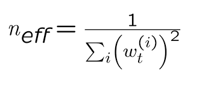

# 2D Feature-based Localization Challenge


## Table of Content
- [2D Feature-based Localization Challenge](#2d-feature-based-localization-challenge)
  - [Table of Content](#table-of-content)
  - [Introduction:](#introduction)
  - [Problem Statement:](#problem-statement)
  - [How to Run](#how-to-run)
  - [Solution](#solution)
    - [Method](#method)
      - [1. Initialization:](#1-initialization)
      - [2. Prediction:](#2-prediction)
      - [3. Update:](#3-update)
      - [4. Resampling:](#4-resampling)
      - [5. Estimation:](#5-estimation)
      - [5. Visualization:](#5-visualization)
    - [Key Decisions](#key-decisions)
      - [Dealing with Kidnapped Robot Problem](#dealing-with-kidnapped-robot-problem)
      - [Choosing Hyper-Parameters](#choosing-hyper-parameters)
      - [Deciding how often to resample](#deciding-how-often-to-resample)
    - [Future Improvements](#future-improvements)
      - [Adaptive Number of Particles](#adaptive-number-of-particles)
      - [Using Better Methods](#using-better-methods)

## Introduction:
This challenge is inspired by the international RoboCup competition, where teams of autonomous robots play against each other in the game of soccer.
To read the full challenge instruction check [this pdf file](media/Localization_Challenge.pdf).

## Problem Statement:
The goal is to implement a localization engine in C++ that estimates the three-dimensional state of the robot at each time step.


*The field layout displaying the global coordinate frame, the four landmarks, an example robot start position (with sensor field of view shown), and an example goal position for the robot to achieve (orange circle).*

* robot state: [x, y, &theta;]
* robot motion is modelled as differential drive.
* landmark indices: [0-3]
* local observation: [distance (in meters), orientation (in radians)] where orientation is between [-&pi;, &pi;]
* controller provides movement updates as [&Delta;x, &Delta;y, &Delta;&theta;] from odometry in local reference frame.
* you can find robot's parameters in [include/robot_defs.h](include/robot_defs.h).


## How to Run
clone the repository:
```
    git clone https://github.com/Jeyhooon/2d_landmark_based_localization.git
```
go to the repository directory:
```
    cd 2d_landmark_based_localization
```
build the project:
```
    make
```
run the project (check data folder for other input files):
```
    ./localization_test ./data/sample_input1.txt
```
Here is a summary of all available user input commands:
* Enter key - Pause/unpause program
* Space bar - Enter/exit randomization mode (automated goal selection)
* ’s’ - Changes the camera scan mode [1-4] (front, sweep, cursor, fixed)
* ’x’ - Disables all vision. Useful for testing odometry-only estimation.
* ’r’ - Toggle display of robot/visual field of view on/off
* 'p' - Toggle display of particles on/off
* Left/right arrow keys - Changes the robot orientation manually
* Left mouse click - Selects new goal position at mouse location
* Right mouse click - Selects new robot position at mouse location

## Solution
To solve this challenge Monte Carlo Localization (MCL) algorithm is considered which is a popular method used in robotics to estimate the position and orientation of a robot in an environment. 

The algorithm utilizes a set of particles to represent the probable states (positions and orientations) of the robot. Each particle represents a hypothesis about the robot's state, and the set of particles gives a probabilistic representation of the robot's belief about its state.
### Method
The method implementations are mainly done in [src/main.cpp](src/main.cpp) file. The helper functions used in ``main.cpp`` are implemented in [src/helper_func.cpp](src/helper_functions.cpp) file.
#### 1. Initialization:
There are two possibilities for Initialization:
* **initial estimate of state is given**: In this case, the particles are initialized around the given state with a Gaussian distribution.
* **otherwise**: In this case, the particles are uniformly distributed in the environment.
  
You can find the implementation of this part in [src/main.cpp](src/main.cpp) in `myinit(...)` function.

#### 2. Prediction:
Based on the movement updates ([&Delta;x, &Delta;y, &Delta;&theta;]) observed from the robot's odometry, the particles are moved accordingly (&Delta; values already include noise from odometry).

To implement it correctly, we need to pay attention that the &Delta; values are the relative change in position of the robot in local robot coordinates. However, the particles are in global coordinates. Therefore, we need to transform the &Delta; values from local to global coordinates before applying them to the particles as shown below:

*(first translation, then rotation and also clip &theta; between [-&pi;, &pi;])*

Implementation of this part is in [src/main.cpp](src/main.cpp) in `motionUpdate(...)` function.

#### 3. Update:
* When a landmark observation ([distance, orientation]) is received, the weight of each particle is updated based on how well its predicted observation matches the real observation. The function that calculates how likely the observations are from particle's perspective is implemented in [src/helper_func.cpp](src/helper_functions.cpp) in `obsLikelihood(...)` function.

* The weight of a particle increases if its prediction is close to the observation and decreases otherwise. It's important to note that the weight of a particle is not a probability (do not necessarily sum to 1); hence, we do normalize them after calculating them for all the particles. 
  
* The implementation can be found in [src/helper_func.cpp](src/helper_func.cpp) in `updateWeights(...)` function.

#### 4. Resampling:
* After updating the weights of the particles, we need to resample them. The resampling is done based on the weights of the particles using [Resampling Wheel](https://www.youtube.com/watch?v=wNQVo6uOgYA) technique. The particles with higher weights are more likely to be sampled (some small noise is added to the resampled particles to encourage diversity). 
  
* The implementation can be found in [src/helper_func.cpp](src/helper_func.cpp) in `resampleParticles(...)` function.

#### 5. Estimation:
* The final estimation of the robot's state is calculated by taking the mean of the particles' states (worked better than weighted mean, also used running average to smooth out the state estimation between time steps).
  
* Implementation can be found in [src/helper_func.cpp](src/helper_func.cpp) in `updateCurrentEstimate(...)` function.

#### 5. Visualization:
* For visualization GL library is used. Particles are drawn as cyan points and their orientations are drawn as red lines. To toggle the display of particles on/off press 'p' key.

* The implementation can be found in [src/main.cpp](src/main.cpp) in `mydisplay(...)` function.

### Key Decisions

#### Dealing with Kidnapped Robot Problem
The *kidnapped robot problem* arises when the robot is physically relocated to an unknown location, causing a drastic mismatch between its estimated position and its actual position. 

To tackle this in MCL algorithm usually some small amount of random particles are added during resampling to make sure we have some particles in the right place. However, this method is not very efficient and can take a long time to recover from the kidnapped robot problem. 

Since the observed landmark is known in this challenge, we can use this information to sample cleverly instead of sampling randomly. The idea is to sample particles around the observed landmark given the observed distance as shown in figure below (in the valid range). 


This ensure that the particle filter can maintain multiple modes to represent the likelihood of both the previous belief and the potential new location after the robot is kidnapped.

Moreover, instead of sampling these particles at each resampling step, it's better to check the likelihood of current estimated state. If it's smaller than some threshold, then we can resample around the observed landmark. This way code runs faster and more efficiently.

This method is implemented in [src/helper_func.cpp](src/helper_func.cpp) in `sampleCircular(...)` function.

#### Choosing Hyper-Parameters
* **Number of Particles**: 
Chosen based on a balance between computational efficiency and accuracy. More particles generally provide a better representation at the cost of higher computation.

* **Kidnapped Threshold**:
Chosen based on the accuracy of the robot's state estimation. If the likelihood of the current estimated state is smaller than this threshold, then resample around the observed landmark.

* You can find the rest of the hyper-parameters in [include/robot_defs.h](include/robot_defs.h) under ```/* Parameters for MCL algorithm */```

#### Deciding how often to resample
Resampling too much can cause the particles to converge to a single mode and lose diversity. On the other hand, resampling too little can cause the particles to diverge and lose accuracy. To find the right balance the concept of **effective number of particles** (Neff) is used.

It is a measure of the diversity or spread of the particles. It's used to gauge how "informative" the current set of particles is and to decide whether to trigger a resampling step. Can be calculated as:



**High Neff**: The particles are well spread out and informative. No need to resample.

**Low Neff**: The particles are clustered and not informative. Resample.

**Triggering Resampling**: Resampling is triggered when Neff is less than some threshold (e.g.: N_particles/2).

The implementation can be found in [src/main.cpp](src/main.cpp) in `sensorUpdate(...)` function.

### Future Improvements

#### Adaptive Number of Particles
Adjust the number of particles in real-time based on the uncertainty in the robot's state. During high uncertainty (like after being kidnapped), increase the number of particles, and decrease when the robot's state is more certain.

#### Using Better Methods
Like using [Mixture-MCL algorithm](https://www.sciencedirect.com/science/article/pii/S0004370201000698?ref=cra_js_challenge&fr=RR-1) which works well with small sample size and recovers faster from robot kidnapping.
